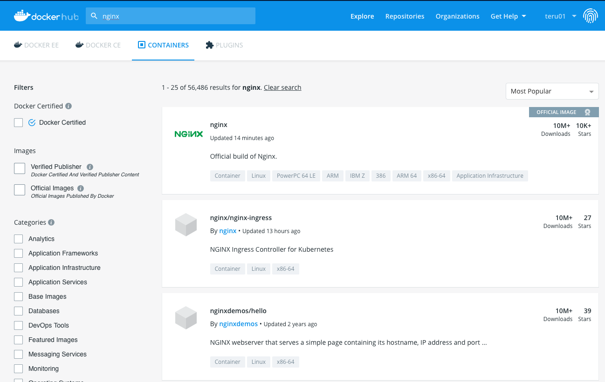

<!--
theme: gaia
template: default
page_number: true
paginate: true
style: |
    ul {
        font-size: 48px;
    }
    li li {
        font-size: 38px;
    }
    section.title *, h1 {
        text-align: center;
    }

-->

# Docker講習会

- 目的
  - Dockerすごいって思ってもらう
  - Dockerこわくないって思ってもらう
  - Docker使っても良いかもって思ってもらう

---

# Dockerとは？

- コンテナ型仮想環境の構築・管理ツール
- コンテナ型仮想化って？
  - 「コンテナ」という独立した区画を作成し，そこで仮想環境を作る技術
  - VMほどしっかりと分離されていない

VM: ホストOSからは別のマシンとして見える
コンテナ: ホストOSからはプロセスとして見える

---

# とりあえず使ってみよう

```
(vm)$ sudo docker run -p 8080:80 nginx:1.17-alpine
```

ブラウザで，`localhost:8080`を開いてみよう

このnginxはどこで動いている？

---

# 仮想環境をなぜ使うのか

- ホスト環境との分離のため
  - 依存ソフトウェアのバージョン衝突防止
- 開発者間での環境共有のため
  - 仮想環境を渡すだけですぐ開発開始できる
- デプロイの容易さのため
  - 仮想環境ごとデプロイすれば楽

---
.
.
.
.
# 別にDockerじゃなくても普通のVMで良いのでは？

---

# Dockerをなぜ使うのか

- コンテナ型仮想化
  - 軽量（すぐ起動，すぐ終了，サイズ小）

- 強力なエコシステム
  - 多様な周辺ツール
  - クラウドによるマネージドサービス

---

# Dockerのキホン

- Dockerイメージ
  - コンテナのもと．
- Dockerコンテナ
  - 仮想環境を動かすもの．Dockerイメージから生成される．

この2つはオブジェクト指向でいうクラスとインスタンスの関係に似ている．これからイメージとコンテナの関係をつかんでいこう

---

# Dockerイメージを確認しよう

```
(vm)$ sudo docker images
```

```
REPOSITORY          TAG                 IMAGE ID            CREATED             SIZE
nginx               1.17-alpine         48c8a7c47625        5 weeks ago         21.8MB
```

先ほどの`docker run` は「イメージを取得してコンテナを生成，起動」するコマンド

---

# コンテナを起動

```
$ sudo docker run -d -p 8080:80 --name myserver nginx:1.17-alpine
```

"-d"と"--name [name]"オプションがつきました．
コンテナを確認してみよう

```
$ sudo docker container ps
```
```
CONTAINER ID        IMAGE               COMMAND                  CREATED             STATUS              PORTS                  NAMES
756632c14e60        nginx:1.17-alpine   "nginx -g 'daemon of…"   17 seconds ago      Up 16 seconds       0.0.0.0:8080->80/tcp   myserver
```

---

# コンテナに入ろう


コンテナ内部に入ってみよう．

```
$ sudo docker container exec -it myserver sh
/ #
```

コンテナ内部の`/`(ファイルシステムルート)に移動しました．
ホストOSとはファイルシステムが分離されているのがわかります．

---

# コンテナ内部のOS？

```
(container)/ # cat /etc/os-release
NAME="Alpine Linux"
ID=alpine
VERSION_ID=3.10.4
...
```

Alpine Linuxは非常に小さなLinuxディストリビューションで，よくDockerイメージに利用されます．

コンテナ内部でホストとは別のOSが動いているように見えますが，実際はそのように見せかけているだけです．
参考: https://qiita.com/kirikunix/items/33414240b4cacee362da

---

# コンテナ内部に変更を加える

```
/ # echo "helloooo" >> /usr/share/nginx/html/index.html 
/ # exit
```

`index.html`はnginxで配信されているファイルです．`>>` でファイルに追記しています

ブラウザに反映されていますか？

---

# もう1つコンテナを起動しよう

```
$ sudo docker run -d -p 8081:80 --name myserver2 nginx:1.17-alpine
```

イメージは同じ`nginx:1.17-alpine`です．

- 名前は`myserver2`
- -pに指定するのは`8081:80`

に注意してください．

---

# ブラウザで確認

`localhost:8080`と`localhost:8081`を見比べてみよう


---

# わかったこと

- イメージはコンテナの"もと"
- イメージからコンテナをたくさん生成できる
  - イメージさえ渡せば，同じ環境を作成できる
- コンテナ同士は独立している
- コンテナ内部で変更を加えても，イメージには影響しない
  - コンテナ内部で色々変更するべきでない

---

# 仮想環境をなぜ使うのか（再掲）

- ホスト環境との分離のため
  - 依存ソフトウェアのバージョン衝突防止
- 開発者間での環境共有のため
  - 仮想環境を渡すだけですぐ開発開始できる
- デプロイの容易さのため
  - 仮想環境ごとデプロイすれば楽

---

# 今更だけど今日のシステム構成

- DockerをVM (Ubuntu Xenial)上で動かしている
  - DockerはLinux上の方が良い感じに動くので
  - 厳密にはLinux*でしか*動かない
- Vagrant: Virtualboxのような仮想化ソフト（ハイパバイザ）の構成ツール
- Vagrantfileにポート転送の設定を書いてるのでホストから疎通できるようになってます

---

# イメージを作る

- コンテナをいじるのが良くないことがわかった
- じゃあ，イメージごといじれば良い！

## 作り方
- Dockerfileを書いてビルドする
- コンテナから生成する

---

# Dockerfile

- イメージの設計図
- 記述すること
  - ベースにしたいイメージ
  - イメージ作成時に実行したいコマンド
  - コンテナ実行時に実行したいコマンド
などなど

---

# Dockerfile見てみる

VMの`/vagrant/hello-dockerfile/Dockerfile`をみてみよう

```
FROM nginx:1.17-alpine
```

FROM: ベースとなるイメージを指定

```
COPY ./nginx.conf /etc/nginx/nginx.conf
```

COPY: ホストのファイルをコンテナへコピー

---

```
RUN set -x &&\
    apk --update add openssl &&\
    ...(omitted)
    chmod 400 /etc/nginx/server_private.key
```

RUN: **イメージ作成時**に実行するコマンド
ここで生成したファイルなどはイメージに含まれる


```
CMD ["nginx", "-g", "daemon off;"]
```

CMD: **コンテナ起動時**に実行するコマンド

---

# イメージを作る（ビルド）

```
$ cd /vagrant/hello-dockerfile
$ sudo docker build -t hoge/myserver:1.0 .
```

タグは[Dockerhubのユーザー名]/イメージ名:バージョン で作るのが普通

Dockerfileの"RUN"で指定したコマンドが走りました．できたイメージを`$ sudo docker images`で確認してみよう

---

# コンテナ起動

これはさっきと同様

```
$ sudo docker run -d -p 4443:443 --name https-server hoge/myserver:1.0
```

警告画面が出たら"thisisunsafe"とタイプする

---

# Dockerhub

- dockerイメージがたくさんアップロードされてる



---

# 実際， Dockerはどういうところで使うのか?

- ここまでで基礎は大体OK
- 使われ方をいくつか紹介


---

# ユースケース1: 実行環境を使いたい

- 環境構築がめんどくさいツールを使う時，誰かがDockerhubにイメージをUPしていることがある
  - ただし，安易にイメージを信頼するのはセキュリティ上ダメ


```
$ cd bookmaker
$ docker run --rm -v $(pwd):/work nuitsjp/mdview ./work/build.sh
```

-v: ホストのディレクトリをコンテナにマウント
イメージ名の後に実行コマンドを入力できる

---


---

# ユースケース2: ホストの環境を汚したくない

```
$ sudo docker run --rm -p 8080:8888 -v `pwd`:/home/jovyan/work jupyter/base-notebook
```

---
